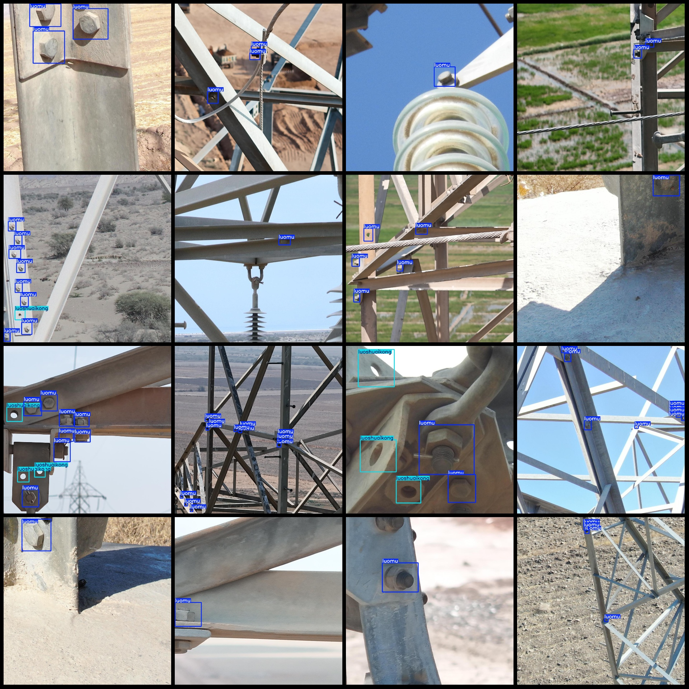
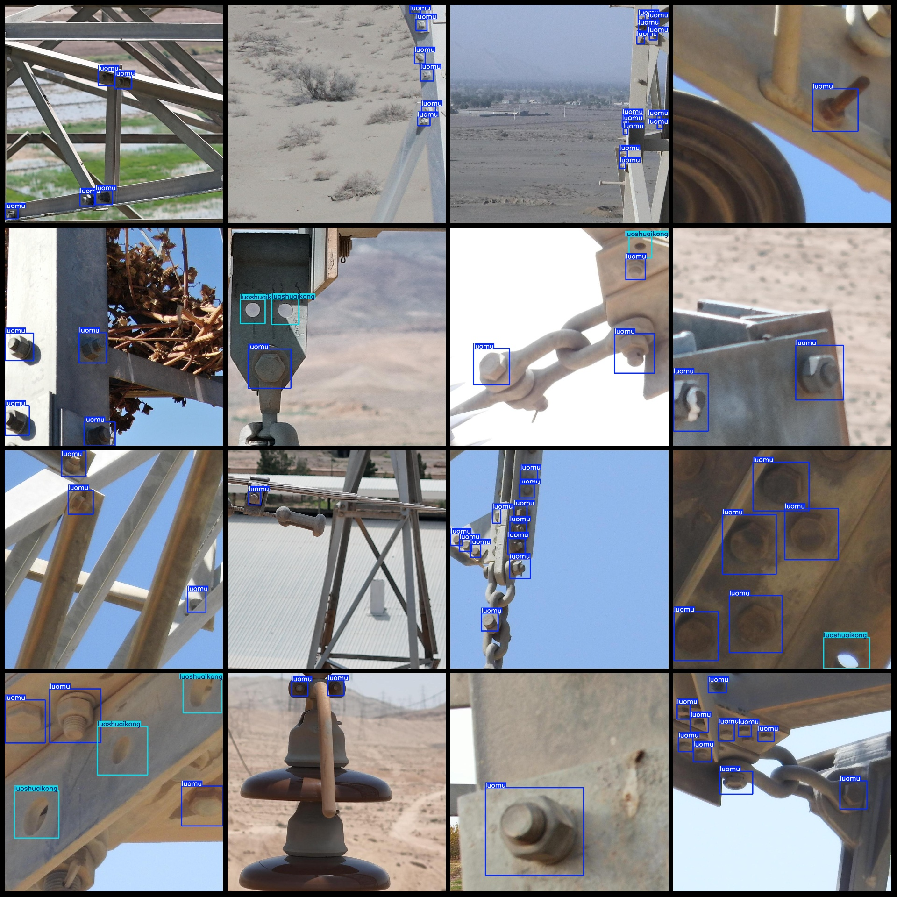

# Power Scene: Wire Rope Hole Nut Detection Dataset in VOC+YOLO Format with 1001 Images and 2 Categories

The dataset format is Pascal VOC format + YOLO format (without the split path in the txt file, only containing jpg images and corresponding VOC format xml files and yolo format txt files).
number of images: 1001  
annotation count: 1001  
annotation count: 1001  
annotationnumber of classes: 2  
annotation class names: ["luomu", "luoshuaikong"]
boxes per class:   
Luomu (nut) box count = 4224  
Luoshuaikong (bolt hole) box count = 548
total boxes: 4772  
images per class:   
luomu images = 944  
luoshuaikong images = 336  
image resolution: 1024x1024  
Use annotation tool: labelImg  
Annotation rule: draw rectangle box for class.
Important Notice: The dataset does not have separate training, validation, and test sets; please partition them yourself.
Special Statement: This dataset does not guarantee the accuracy of the trained models or the weights files.
Preview of the image:
Annotation example:
## Images

Here is a pay link on Stripe ( https://buy.stripe.com/3cs8yP7sY87d0vu9AB ). Please contact me lonlonago@foxmail.com after funding $89, and I will send you a complete data files , thank you!

